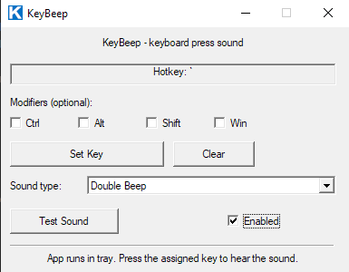
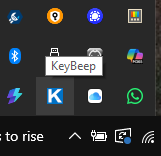
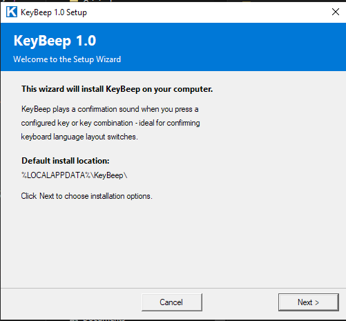

# KeyBeep

> **Origin story:** This app was born out of a real frustration — a slightly sticky keyboard that would occasionally miss the language-switch keypress. With no audible feedback, it was impossible to know whether the key registered or not, leading to typing in the wrong language. KeyBeep solves this by playing an instant sound on every designated hotkey press, giving you immediate confirmation that the key was heard.

Lightweight Windows tray application that plays a configurable sound every time a designated hotkey is pressed.

Useful as an audible confirmation for language-switch keys, mute/unmute keys, PTT buttons, macro keys, or any key you want tactile-style audio feedback for.

---

## Screenshots

| Main window | System tray | Installer |
|:-----------:|:-----------:|:---------:|
|  |  |  |

---

## Features

- Global hotkey with optional modifiers (Ctrl / Alt / Shift / Win)
- 7 sound types: MIDI tones (Low/Mid/High/Double Beep)
- Sound plays reliably even after system sounds or volume OSD — uses a persistent MIDI Out handle
- Runs silently in the system tray; settings window on double-click
- Self-installer: copies itself to `%LOCALAPPDATA%\KeyBeep\` and adds autostart
- All settings saved to registry — survive reboots
- Single EXE, zero installer dependencies, ~80 KB

---

## Build

Requires Visual Studio 2017 / 2019 / 2022 (Community or higher).

```bat
build.bat
```

Produces:
- `KeyBeep.exe` — the main tray application
- `setup.exe` — installer wrapper (embeds `KeyBeep.exe` as resource, extracts and installs on run)

### Dependencies (all Windows built-in)
| Library | Used for |
|---|---|
| `user32.lib` | Window management, hooks, tray API |
| `kernel32.lib` | Threads, registry, file I/O |
| `shell32.lib` | Tray icon (`Shell_NotifyIcon`), `SHGetFolderPath` |
| `winmm.lib` | MIDI Out (`midiOutOpen`, `midiOutShortMsg`) |
| `comctl32.lib` | Common controls |
| `gdi32.lib` | GDI drawing |
| `advapi32.lib` | Registry API |

---

## Installation

### Option A — via setup.exe
Run `setup.exe`. It extracts and installs `KeyBeep.exe` to `%LOCALAPPDATA%\KeyBeep\` and adds it to Windows autostart.

### Option B — via tray menu
Run `KeyBeep.exe` directly, then right-click the tray icon → **Install (add to autostart)**.

### Uninstall
Right-click tray icon → **Uninstall**, or run `KeyBeep.exe /uninstall`.

---

## Usage

1. Double-click the tray icon (or right-click → **Open Settings**)
2. Click **Set Key** and press the desired key (with any modifiers held)
3. Check/uncheck **Ctrl / Alt / Shift / Win** if needed
4. Choose a **Sound type** from the dropdown
5. Press **Test Sound** to verify
6. Check **Enabled** — the window can be closed; KeyBeep keeps running in the tray

### Sound types

| Name | Description |
|---|---|
| Beep low (400 Hz) | Low MIDI tone, 80 ms |
| Beep medium (800 Hz) | Mid MIDI tone, 80 ms |
| Beep high (1200 Hz) | High MIDI tone, 80 ms |
| Double Beep | Two ascending MIDI tones |


---

## Technical notes

### Why MIDI instead of WASAPI / waveOut?
WASAPI and waveOut fail silently for ~100–300 ms after the Windows Audio Engine restarts — which happens every time the volume OSD plays a notification sound. MIDI Out (`winmm`) bypasses the audio engine and routes directly to the Microsoft GS Wavetable Synth, so it is unaffected.

### Persistent MIDI handle
`HMIDIOUT` is opened **once** at application startup (`WM_CREATE`) and kept open until exit (`WM_DESTROY`). Opening/closing the handle on every keystroke causes failures after system audio events. Instrument and volume are initialised once after open.

### Hook thread safety
The low-level keyboard hook (`WH_KEYBOARD_LL`) must return within `LowLevelHooksTimeout` (~300 ms) or Windows silently removes it. All sound playback runs on a dedicated worker thread (`CreateThread`) — the hook callback only posts a `WM_USER+10` message and returns immediately.

### Settings storage
```
HKCU\Software\KeyBeep
  VK      REG_DWORD   Virtual key code of the hotkey
  Ctrl    REG_DWORD   1 = Ctrl modifier required
  Alt     REG_DWORD   1 = Alt modifier required
  Shift   REG_DWORD   1 = Shift modifier required
  Win     REG_DWORD   1 = Win modifier required
  Sound   REG_DWORD   SoundType enum value (0–6)
  Enabled REG_DWORD   1 = hook active
```

---

## Files

| File | Description |
|---|---|
| `main.cpp` | Main application source |
| `resource.h` | Resource IDs for main app |
| `app.rc` / `app.res` | Icon resource for main app |
| `setup.cpp` | Installer source (embeds KeyBeep.exe as RCDATA) |
| `setup_resource.h` | Resource IDs for installer |
| `setup.rc` / `setup.res` | Resources for installer |
| `build.bat` | Build script (auto-detects VS, builds both EXEs) |

---

## License

```
Copyright (c) 2026 Taras Pavlyk <djimbialo@gmail.com>. All rights reserved.

This software and its source code are the exclusive property of the copyright
holder, Taras Pavlyk. They are proprietary and confidential.

No part of this software, including its source code, binaries, design,
documentation or any portion thereof, may be copied, reproduced, modified,
adapted, translated, published, distributed, transmitted, sublicensed, sold,
rented, leased, or used to create derivative works, in whole or in part, by any
means or in any form, without the prior express written permission of the
copyright holder.

No license or right of any kind is granted to any third party. Any unauthorized
use, reproduction, or distribution of this software, or any portion of it, is
strictly prohibited and may result in civil and criminal liability.

THE SOFTWARE IS PROVIDED "AS IS", WITHOUT WARRANTY OF ANY KIND, EXPRESS OR
IMPLIED, INCLUDING BUT NOT LIMITED TO THE WARRANTIES OF MERCHANTABILITY, FITNESS
FOR A PARTICULAR PURPOSE AND NONINFRINGEMENT. IN NO EVENT SHALL THE AUTHOR OR
COPYRIGHT HOLDER BE LIABLE FOR ANY CLAIM, DAMAGES OR OTHER LIABILITY, WHETHER IN
AN ACTION OF CONTRACT, TORT OR OTHERWISE, ARISING FROM, OUT OF OR IN CONNECTION
WITH THE SOFTWARE OR THE USE OR OTHER DEALINGS IN THE SOFTWARE.
```
